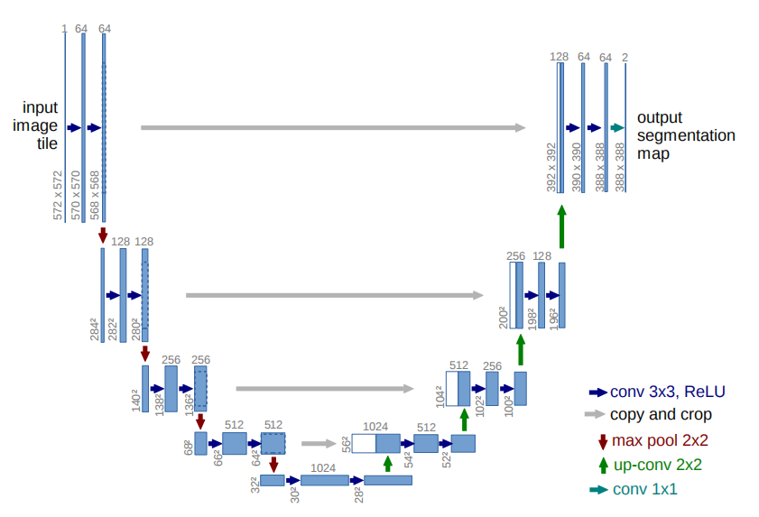
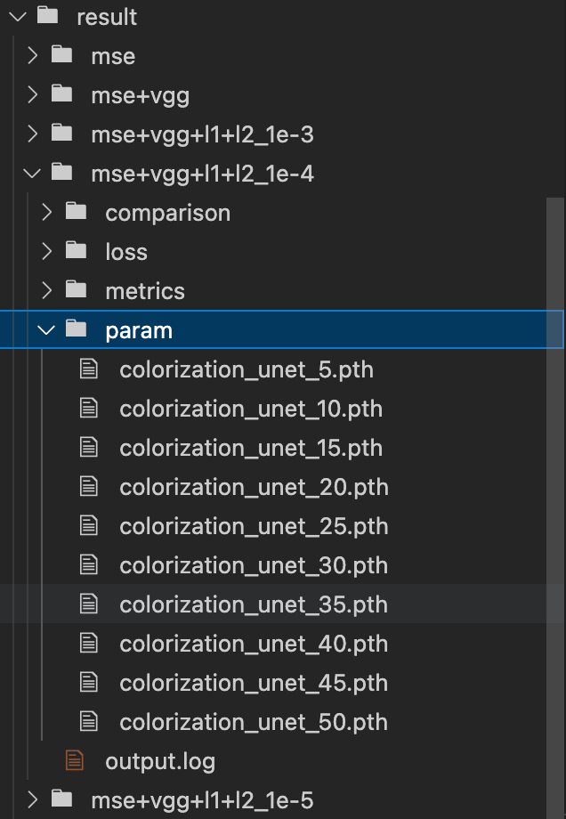

# 彩色图像生成任务

## 任务描述

建立一个能够给黑白图片上颜色的生成神经网络模型。

相关信息：

- 数据集位置 https://pan.baidu.com/s/1qDN10qbSgnc_m6tFpXw51A
- 数据集包含 60k 彩色图片和对应的黑白图片，图像均是 32\*32，分为 10 个类，每类彩色黑白各 6k 张图
- 50k 图片构成训练集，10k 图片构成测试集

## 解决思路

### 模型设计

可以使用 U-Net 作为基础模型，U-Net 是一种常用的图像生成和分割模型。UNet 的结构呈现出一个 U 形，由一个编码器（压缩路径）和一个解码器（扩展路径）组成,其编码器部分用于提取特征，解码器部分用于生成目标图像

1. 编码器（Contracting Path）: 编码器的主要功能是逐步压缩输入图像，提取出高层次的特征。编码器通常由多个卷积层和池化层组成：

   - 卷积层：使用一系列的卷积操作来提取图像的特征，每个卷积操作后跟随一个 ReLU 激活函数。
   - 池化层：通常使用最大池化（Max Pooling）来降低特征图的尺寸，从而实现特征的空间压缩。

2. 解码器（Expanding Path）:解码器的主要功能是逐步恢复图像的空间分辨率，同时保留从编码器中提取的特征。解码器通常由多个上采样层和卷积层组成：

   - 上采样层：通过上采样操作（如反卷积或双线性插值）增加特征图的尺寸。
   - 卷积层：使用卷积操作来恢复图像的细节，每个卷积操作后同样跟随一个 ReLU 激活函数。

### 损失函数

- 感知损失：通过一个预训练的卷积神经网络（如 VGG-16）提取高层特征，并计算生成图像和真实图像之间的差异。
- 颜色损失：可以直接通过 MSE 来计算计算生成图像和真实图像在像素级别上的差异
- 正则化项：同时使用 L1 正则化和 L2 正则化来限制模型参数，从而防止模型过拟合

### 评估指标

在这里主要使用 PSNR 和 SSIM 对模型进行评估（由于算力限制，并未在每个 Epoch 都对评估参数进行计算，而是和模型结果保存放在一起，每五个 Epoch 进行一次计算）

- PSNR（Peak Signal-to-Noise Ratio）是衡量图像质量的一个常用指标，它表示的是两幅图像之间的最大像素值与噪声之间的比例。PSNR 值越高，表示生成的图像质量越好。
- SSIM（Structural Similarity Index Measure）用于衡量两幅图像之间的相似性，它能够更好地反映图像的结构信息。SSIM 值越接近 1，表示两幅图像越相似。

### 训练过程

在训练过程中，使用随机梯度下降法（如 Adam 优化器）来最小化损失函数。同时在每个 epoch 后进行验证，并记录训练和验证的损失。在实际训练过程中，每五个 epoch 对当前模型的训练结果进行记录，生成对应的模型参数 pth 文件、模型推理效果对比图、模型损失函数曲线以及模型评估指标

### 训练结果

训练结果包含五部分，分别是 comparison、loss、metrics、param 和 output.log，分别存储着训练过程中每 5 个 epoch 对应的生成图片对比图、损失函数图、模型指标评估图、模型参数以及模型训练日志

## 训练结果分析

### 对于不同损失函数功能的分析

在最开始时候想实验观看不同损失函数对于模型训练结果的影响，因此做了以下几组实验，这些实验除了使用的损失函数不同外，其余参数均保持相同

Epoch: 50, learning rate: 1e-4, train-valid split: 9:1

- 实验一: MSE
- 实验二: MSE + VGG-16
- 实验三: MSE + VGG-16 + L1 Norm + L2 Norm

经过对于实验结果的比较可以发现，对于实验一和实验二来说，模型均出现了过拟合的现象，损失函数在训练集上不断下降，但是在验证集上仍保持着基本不变甚至有上升的趋势，而对比实验三可以看到，随着训练的不断进行，在训练集和验证集上的损失函数均不断下降，说明添加 L1 和 L2 正则项起到了一定的效果，通过对比也说明正则项在防止模型过拟合功能上起到的重要效果

对比实验一和实验二来说，通过最终生成的图像也可以看出，添加了 VGG 之后，模型对于色彩的感知能力明显增强，生成的图片中可以看到有部分鲜明的色彩被生成出来，而在只使用 MSE 的模型上得到的结果色彩相对来说比较的普通，在色调变化不是很大的图形上生成结果相对较优

### 超参数调优

由于算力及时间的限制，本次实验并未对所有参数进行调优，而只是看了通过设置不同初始学习率模型可以取得的效果，在下面的实验中，除了初始学习率不同，其余参数均保持一致

Epoch: 50, train-valid split: 9:1, Loss Func: MSE + VGG-16 + L1 Norm + L2 Norm

- 实验四: learning rate - 1e-3
- 实验五: learning rate - 1e-4
- 实验六: learning rate - 1e-5

通过观察三次实验的损失函数图像可以看出相比较于实验四及实验五来说，实验六在最初的五个 Epoch 中是学习到部分东西，但是在后续的训练过程中，模型损失曲线并无太大变化，说明学习率设置过低并没有学习到什么有用的东西，而前面两个实验的曲线可以看到损失函数一直是有明显下降趋势，同时结合生成的对比图来看模型确实是在不断进步优化

### 模型评价指标分析

观察评估指标对比图可以发现，添加了正则项之后，模型性能下降比较明显，这是因为加入正则项之后对于模型要求比较苛刻，从而需要相对来说更长的训练时间，也就是说需要更多的 Epoch 才能达到相同的效果
