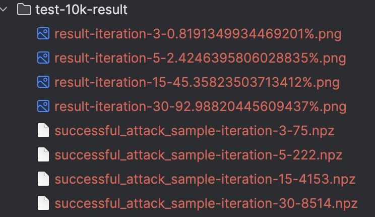
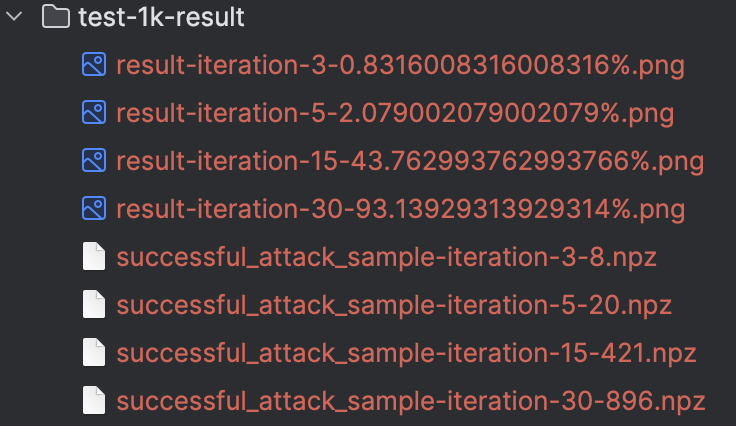
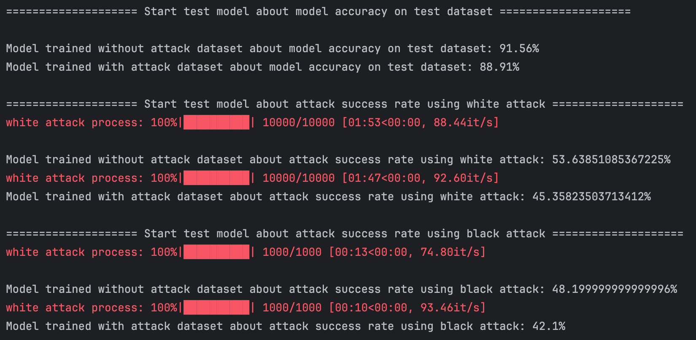

# 图像分类模型的对抗攻击和对抗训练

## Task1 模型训练及白盒攻击

- 首先在Fashion-MNIST数据集上训练一个模型，要求在test集上的准确率不低于90%
- 从test集上挑选至少1000张可以被分类器正确分类的图像
- 使用这些图像进行白盒攻击，得到对抗样本

### Task1.1 模型训练

模型定义如下，是一个很基础的`cnn`模型，包含两个卷积层，和两个全连接层

```python
class SimpleCNN(nn.Module):
    def __init__(self):
        super(SimpleCNN, self).__init__()
        self.conv1 = nn.Conv2d(1, 32, kernel_size=5)
        self.conv2 = nn.Conv2d(32, 64, kernel_size=5)
        self.fc1 = nn.Linear(1024, 128)
        self.fc2 = nn.Linear(128, 10)
        self.pool = nn.MaxPool2d(2)
        self.relu = nn.ReLU()

    def forward(self, x):
        x = self.relu(self.pool(self.conv1(x)))
        x = self.relu(self.pool(self.conv2(x)))
        x = torch.flatten(x, 1)
        x = self.relu(self.fc1(x))
        x = self.fc2(x)
        return x
```

模型训练函数可见 [train.py](./task1/train.py), 训练时使用Adam作为学习率优化函数，使用交叉熵作为损失函数，
共训练15个Epoch，最终模型准确率为**91.56%**，模型定义可见 [model.py](./task1/model/model.py)，
模型参数保存在 [model-param](./task1/model/model_params-91.56%25.pth)

### Task1.2 白盒攻击

白盒攻击就是在已知模型具体架构的情况下，通过调用模型推理某张图片，计算输出与要攻击的类别的损失函数距离，
然后根据模型计算得到的梯度来更新图片，从而达到在人眼不可视的前提下改变模型对图片的预测输出

本次实验对于白盒攻击的代码定义于 [white_attack.py](./task1/white_attack.py)
中，具体使用的方法是基于梯度的白盒攻击方法，使用了迭代的方式，在每个迭代中根据模型的梯度信息来更新输入图像，以实现攻击的目标。

攻击核心代码如下：

```python
# 白盒攻击
optimizer = torch.optim.Adam([image], lr=0.01)
attack_success = False
for _ in range(iterations):
    optimizer.zero_grad()
    output = model(image)
    pred = output.max(1, keepdim=True)[1]
    if pred.item() == target_label.item():
        attack_success = True
        break
    loss = criterion(output, target_label)
    loss.backward()
    optimizer.step()

# 判断是否攻击成功
if attack_success:
    successful_samples.append((origin_image, label, image, target_label))

```

通过改变不同的iterations来改变迭代次数，当迭代次数较大时可以得到较高的攻击成功率

在Fashion-MNIST-10k测试集上的攻击成功率具体可参见下图(npz文件中存储着攻击成功的原始样本及对抗样本):



在助教提供的1k数据集上的攻击成功率可参见下图：



下方分别展示了最大迭代轮数为5和30的图片，可以看到**在5轮之后原始图片和对抗样本之间人眼很难区分出差别**
，但是在30轮之后可以很明显的看出二者之间的差别

迭代5轮后原始图片和对抗样本之间的对比图


迭代30轮后原始图片和对抗样本之间的对比图


## Task2 黑盒攻击

黑盒攻击要求通过采样的方式或者样本迁移的方式对助教提供的模型进行攻击，在这里我选用的是样本迁移的方式，
使用了在1k数据集上经过30轮迭代后产生的896张原始图片以及对抗样本对助教提供的模型进行攻击，最终得到了**11.38%**的准确率

在黑盒攻击成功的样本中随机选出10组如下：


## Task3 对抗训练

对抗训练具体要求步骤如下：

1. 在训练集中选出至少1k的训练样本，进行白盒攻击并得到其对抗样本
2. 将对抗样本和原始数据集合并训练新的模型
3. 对比新旧模型在test集上的准确率
4. 在新旧模型上分别进行白盒攻击，对比准确率
5. 在新旧模型上分别进行黑盒攻击，对比准确率

### Task3.1 得到额外的训练样本

该部分对应的代码位于 [get_new_dataset.py](./task3/get_new_dataset.py) 中，在该部分代码中，首先需要使用在task1中训练好的模型在训练集上进行推理，
筛选得到可以推理成功的样本，然后从中随机选出5k张，然后调用白盒攻击生成这些样本的对抗样本，最后将其保存到一个npz文件中用于新模型的训练

### Task3.2 合并数据集，训练新模型

该部分的代码位于 [train_new_model.py](./task3/train_new_model.py) 中，在该部分代码中，通过 `load_dataset()`
函数将在Task3.1中生成的对抗样本以及原始的训练集通过 `ConcatDataset()`
进行合并，生成新的dataset，然后使用新dataset对模型进行训练，使用的超参数及模型与在Task1中训练的模型完全一致，
最终得到的模型在测试集上可以达到 **88.91%** 的准确率，这是以为有噪声样本的加入，对模型得到干扰较大，在预期之中，通过训练多个Epoch可以解决这个问题，这里主要是为了与原模型保持一致

### Task3.3 对两个模型进行评测

该部分代码位于 [evaluate_two_model](./task3/evaluate_two_model.py)
中，首先先将两个模型加载进来，分别是`model_without_attack`以及`model_with_attack`
，然后在后面的部分分别对新旧模型从三个不同的方面进行测试对比，最终得到的准确率或成功率如下所示



#### Task3.3.1 新旧模型在Test集上的准确率

查看上图中的结果，可以看出旧模型的准确率较高，新模型的准确率较低，这是因为在新模型的训练数据集中，加入了很多噪声数据，如果训练轮次足够的话，是可以取得比旧模型更好的效果的，但是为了控制变量法，这里保持了和旧模型一样的超参数进行训练，所以取得的结果不佳

#### Task3.3.2 在新旧模型上分别进行白盒攻击，对比准确率

查看上图中的结果，可以看出，使用对抗样本训练过后的模型对于白盒攻击的成功率更低，说明对抗训练取得了一定的结果，对于攻击的成功率更低

#### Task3.3.3 在新旧模型上分别进行黑盒攻击，对比准确率

查看上图中的结果，可以看出，使用对抗样本训练过后的模型对于黑盒攻击的成功率更低，说明对抗训练取得了一定的结果，对于攻击的成功率更低