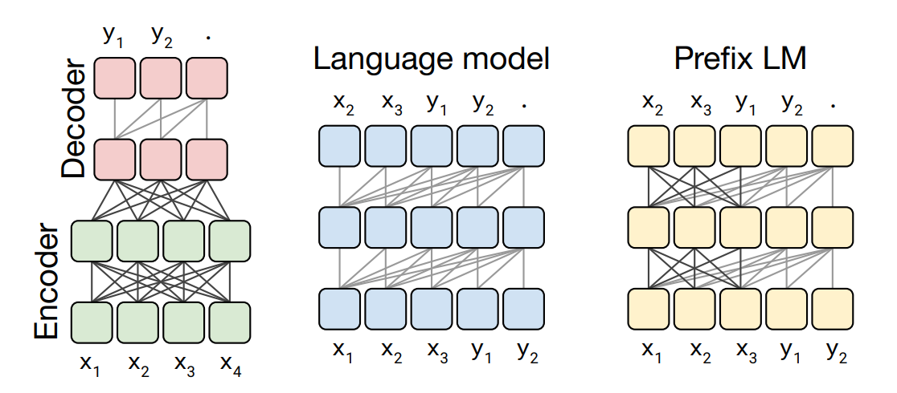
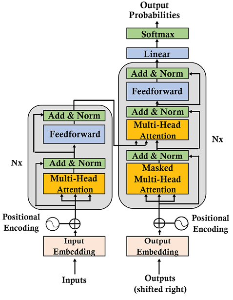
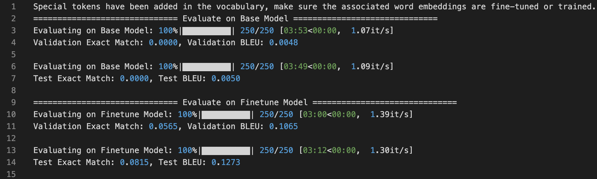

# Code Generation

## 作业描述

Code Generation 是一个以自然语言为输入，输出一个代码片段的任务。要求该输出的代码片段能够完成自然语言输入所描述的编程任务。在通常情况下，自然语言输入的长度单位是一个语句，而相应的程序输出可以是一行代码、多行代码或一个完整的方法体。

CONCODE 是一个较为经典的 Code Generation 任务的数据集。

本次作业的要求是：以 CONCODE 数据集为训练集和测试集，完成一个支持程序代码生成的深度神经网络。

### 一、任务数据集：

本次作业的数据集选用 CodeXGlue 数据集中与代码生成相关的子数据集 CONCODE，数据相关的格式、基本状况可以参考如下的链接：
https://github.com/Dingjz/CodeXGLUE/tree/main/Text-Code/text-to-code

### 二、结果汇报

请提供你的【程序源代码】及【模型训练介绍 PPT】，其中 PPT 应包含以下内容：

1. 请提供你所采用的模型结构的图示及相关说明；
2. 请提供你的模型在验证数据集和测试数据集上的结果，衡量指标采用：Exact Match 和 BLEU
3. 请提供能够体现你的训练过程的 Learn Curve 及相关说明。

## 模型训练

### 模型介绍

该次模型使用的是 Google 的 t5-small 模型，Google T5（Text-to-Text Transfer Transformer）是由 Google Research 提出的一种通用且强大的基于 Transformer 的模型, 在其论文《Exploring the Limits of Transfer Learning with a Unified Text-to-Text Transformer》中介绍了这一模型。T5-small 是 T5 模型中的较小版本，设计目的是在计算资源方面高效，同时在各种自然语言处理任务中仍然提供良好的性能。



T5-small 大约有 6000 万个参数，使其比 T5-base、T5-large 和 T5-3B 等较大的模型更小、更快，同时，T5 基于 Transformer 架构，包括编码器和解码器。编码器处理输入文本，解码器生成输出文本

T5 使用的是原始的 Transformer 架构，其保留了原始 Transformer 的大多数架构。但强调了一些关键的方面。此外，还对词汇和功能做了一些细微的改变。下面列出了 T5 模式的一些主要概念:

- 编码器和解码器仍保留在模型中。编码器和解码器层成为块(block)，子层成为包含自注意层和前馈络的子组件(subcomponent)。像乐高一样，可以组装块和子组件来建立模型。Transformer 组件是标准构件，可以用多种方式组装。
- 自注意是顺序无关的。使用矩阵的点积，而不是递归。它探索了一个序列中每个单词和其他单词之间的关系。在进行点积之前，将位置编码添加到单词的嵌入中。
- 原来的 Transformer 采用正弦和余弦习得位置嵌入。而 T5 使用相对位置嵌入。在 T5 中，位置编码依赖于自注意的扩展来对成对关系进行比较。
- 位置编码是共享的，同时在模型的所有层中重新评估。



### 模型评估

在本次任务中，分多次训练共训练了 60 个 Epoch，各 Epoch 训练参数如下，最终将所有的训练结果汇总后得到如下训练曲线：

1. epoch: 10, gpus: 4, batchsize: 64
2. epoch: 5. gpus: 3, batchsize: 24
3. epoch: 15, gpus: 3, batchsize: 48
4. epoch: 30, gpus: 3, batchsize: 48


使用基准模型(t5-small)和 finetune 后得到的新模型分别在验证集和测试集上进行测试，得到如下结果，可以看出经过 finetune 之后模型在该数据集上取得了很好的进步和优化



## How to run

首先下载对应的`CONCODE`数据集，然后运行下面命令执行训练模型，运行后会自动从 huggingface 下载对应的模型，模型训练日志位于`./log/`下，模型参数保存于`./seq2seq_model/`下，learning curve 位于`./result/`下

```bash
sh run.sh
```

如果服务器网络无法直接连接到 huggingface，可以修改下面脚本的内容运行`download_model.sh`脚本中的内容，然后运行下面命令下载模型

```bash
sh download_model.sh
```

在模型训练结束后，可以通过下面命令对模型进行测试

```bash
sh test.sh
```
