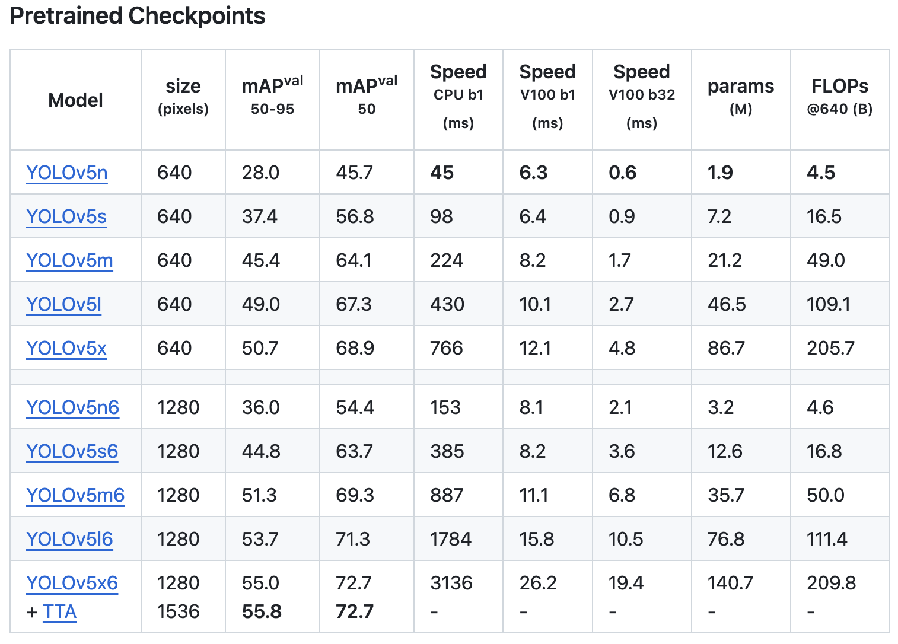
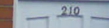
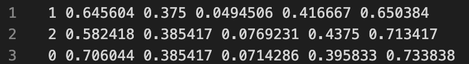
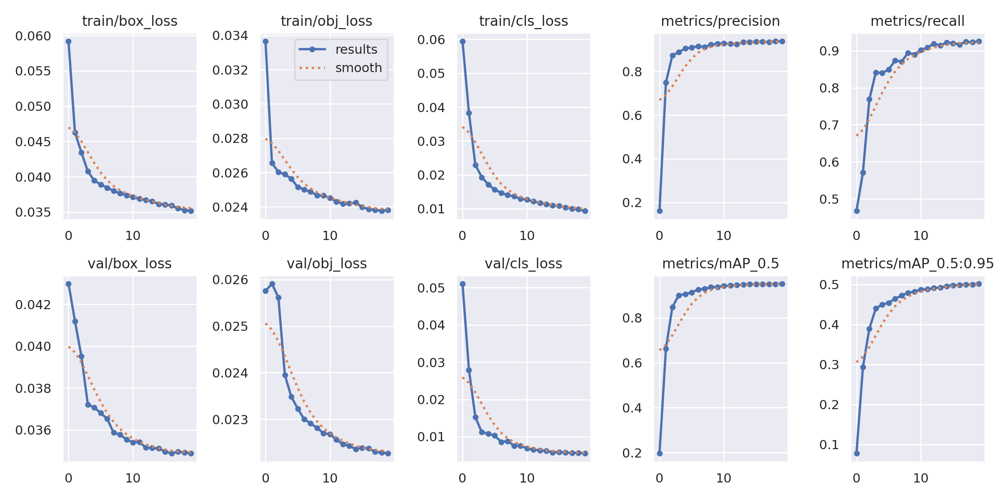
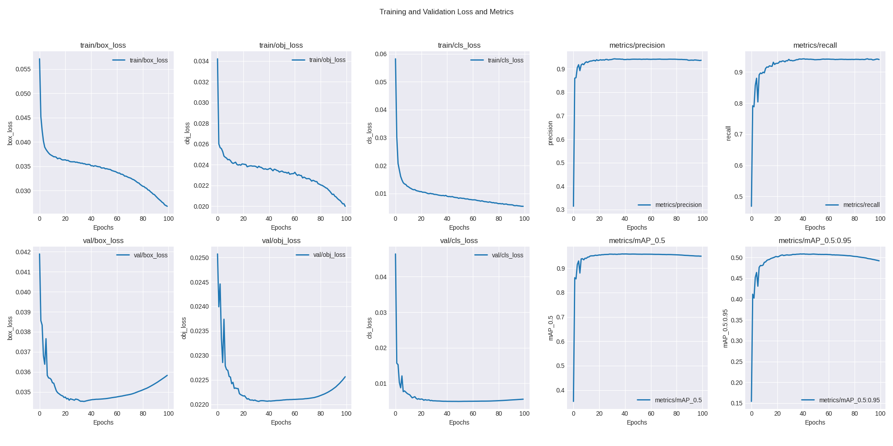

# Street View House Number Recognition

## 任务描述

数据集：http://ufldl.stanford.edu/housenumbers/

SVHN（Street View House Number）Dateset 来源于谷歌街景门牌号码，本次作业的目标数据集是其中的 Format 1 (Full Numbers:
train.tar.gz, test.tar.gz , extra.tar.gz). 其中，train.tar.gz 为训练数据集，test.tar.gz为测试数据集。注：extra.tar.gz是附加数据集，建议不使用。

在train.tar.gz与test.tar.gz中，分别包含：

1. 一些.png格式的图片，每张图片包含一个门牌号；
2. 一个digitStruct.mat文件，包含每张图片所对应的门牌号，以及每个门牌号数字的位置信息；
3. 一个see_bboxes.m文件，用于辅助Matlab环境下的处理，请忽略之。

## 作业要求：

设计一个网络，用train.tar.gz中的数据进行训练，并用test.tar.gz中的数据进行测试；

在测试的过程中，不允许使用test.tar.gz/digitStruct.mat文件中的位置信息作为输入，即必须在“忽略测试数据集中给出的位置信息”的前提下，识别出test.tar.gz中每张图片中的门牌号；

撰写一个PPT，汇报如下信息：

1. 所设计的网络的结构和超参数信息；
2. 网络的训练方法和优化方法；
3. 体现训练过程的“训练曲线”；
4. 识别准确率；

## 功能实现

由于在作业要求中提到在测试的时候不可以使用测试集中给出的位置信息，因此可以分析得到这次作业需要训练得到一个目标检测加分类的模型，因此就想到了用目标检测领域经典的yolov5模型

### 数据预处理

首先需要先下载原始的 [SVHN数据集](http://ufldl.stanford.edu/housenumbers/)，需要获取其中的train.tar.gz与test.tar.gz，下载到本地后对压缩包进行解压，得到原始图像文件及一个`mat`类型的数据标注文件，如果想使用yolov5对该数据集进行训练的话，首先需要将数据集转换为yolov5支持的文件格式，如下所示：
```
data/
    - images/
        - train/
        - val/
    - labels/
        - train/
        - val/
```

因此首先需要先编写代码从`digitStruct.mat`中读取原始标注信息，将其转换为yolov5支持的label格式，对应代码位于[mat2yolo.py](mat2yolo.py)中

将图片格式转换为YOLO训练需要的格式后还需要对数据集进行划分，将其分为train和val两部分，因为要求中说尽量不要使用extra部分的数据，所以在此处，使用随机划分的方式，将train中的数据按照8:2的方式分为train_data和val_data，对应代码位于[train_valid_split.py](train_valid_split.py)中

### 模型训练

从[yolov5仓库](https://github.com/ultralytics/yolov5)中可以看到提供了多种已经预训练好的模型，在刚开始尝试时结合算力考虑选用`YOLOv5s`模型先跑20个Epoch看看测试效果，在两张4090上训练半个小时后的得到模型一，经过测试后发现准确率约为82%（具体测试过程参考[模型测试](#模型测试)部分），于是又考虑使用会不会使用`YOLOv5m`模型会不会得到更高的准确率，然后在又重新使用YOLOv5m模型训练了100个Epoch，在六个小时后得到模型二，经过测试后准确率约为85%



### 模型测试

在测试时可以直接使用yolov5仓库中的`detect.py`文件进行测试，结果会保存在`runs/detect/xxx/labels`下，通过读取`test/digitStruct.mat`中的标签，将其与预测结果进行对比，得到最终的准确率

由于yolov5预测的都是单个数字，而在原始文件中是以一个字符串的形式进行标注的，例如对于`2.png`，mat文件中的label是`012`，而在预测得到的文件是下面的格式，因为缺少位置信息，无法直接将数字进行拼接，所以在计算准确率的时候是将数字全部拼接起来对数字排序后使用逐位对比的形式进行判断




通过对在[模型训练](#模型训练)中的模型进行预测后，对于模型一最终得到 82% 的准确率，对于模型二最终得到85%的准确率

## 实验结果

YOLOv5s模型：


YOLOv5m模型：



## How to run

### 数据集准备

首先先从[SVHN数据集]()下载得到对应的原始数据集，放在`data`目录下，记为`<data_root>`，然后对数据集解压，得到两个文件夹，分别是`<data_root>/train`和`<data_root>/test`

```bash
git clone https://github.com/ultralytics/yolov5.git
```

### 预处理

```bash
python mat2yolo.py --data-root <data_root>/train
```

这会在`<data_root>`目录下生成包含`all_train`的`labels`文件夹

```bash
python train_valid_split.py --data-root <data_root>/train --ratio 0.2 
```

执行该命令会生成训练使用的train和val数据集，文件格式参照[数据预处理](#数据预处理)中提到的文件夹格式

### 模型训练

进入 yolov5 文件夹:
```bash
cd yolov5
```

修改`data/SVHN.yaml`文件中的`path`为自己的数据集保存路径

训练yolov5s模型：

```bash
nohup python train.py --weights weights/yolov5s.pt --cfg models/yolov5s.yaml --data data/SVHN.yaml --epochs 20 --cache --device 0,1  --workers 4 --name yolov5s-result  --batch-size 64 &
```

训练yolov5m模型：

```bash
nohup python train.py --weights weights/yolovms.pt --cfg models/yolov5m.yaml --data data/SVHN.yaml --epochs 100 --cache --device 0,1  --workers 4 --name yolov5m-result --batch-size 64 &
```

具体的模型训练结果及checkpoint可以在`runs/train/<name>`中找到

### 模型测试

使用模型对测试集进行预测

```bash
python detect.py --weights runs/train/yolov5s-result/weights/best.pt --source <data_root>/test  --save-txt --device 0,1  --save-conf --name yolov5s --exist-ok
```

计算准确率

```bash
python ../calc_accuracy.py --predict-result-path runs/detect/yolov5s-result/labels
```


## 相关文档

- https://tianchi.aliyun.com/competition/entrance/531795
- https://tianchi.aliyun.com/forum/post/372315
- https://github.com/joycenerd/yolov5-svhn-detection
- https://github.com/ultralytics/yolov5

